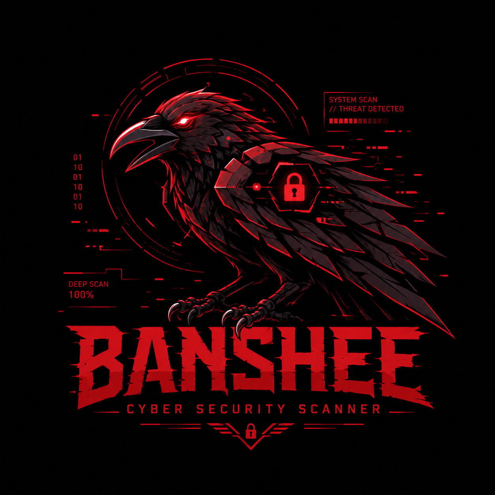

<div align="center">



```
  ██████╗  █████╗ ███╗   ██╗███████╗██╗  ██╗███████╗███████╗
  ██╔══██╗██╔══██╗████╗  ██║██╔════╝██║  ██║██╔════╝██╔════╝
  ██████╔╝███████║██╔██╗ ██║███████╗███████║█████╗  █████╗
  ██╔══██╗██╔══██║██║╚██╗██║╚════██║██╔══██║██╔══╝  ██╔══╝
  ██████╔╝██║  ██║██║ ╚████║███████║██║  ██║███████╗███████╗
  ╚═════╝ ╚═╝  ╚═╝╚═╝  ╚═══╝╚══════╝╚═╝  ╚═╝╚══════╝╚══════╝
```

**Broad-Area Network Scanner for Host Enumeration and Exposure**

*She sees everything you left exposed.*

[](https://python.org)
[](LICENSE)
[](https://github.com/astral-sh/ruff)
[](https://mypy-lang.org)

</div>

---

## What is BANSHEE?

BANSHEE is a passive-first network scanner. Point it at your network and it will map every host, fingerprint services, detect rogue devices, and generate a risk report — without firing a single exploit.

It started as a personal tool for internal lab work and pre-pentest recon. The passive mode is genuinely useful: it sits on an interface and builds a host map purely from observed traffic, zero packets sent.

**Scope enforcement is hard. Scanning outside `config/scope.yaml` raises an error and stops — it is not a warning, it is not configurable.**

Good for:
- Asset inventory on internal networks
- Spotting unknown devices on a segment
- Recon before an authorized pentest engagement
- Continuous exposure monitoring

---

## Features

| Module | What it does |
|---|---|
| **Passive Sniffer** | Listens on an interface, discovers hosts from traffic alone |
| **TCP Sweep** | Async connect-scan, configurable timing templates |
| **ICMP Ping** | Raw ICMP echo |
| **PCAP Replay** | Pull host data from a saved `.pcap` |
| **OUI Lookup** | MAC → vendor |
| **DHCP Parser** | Hostname + MAC from lease files |
| **TCP/IP Stack FP** | OS guess from TTL, window size, TCP flags |
| **TLS/JA4** | Passive TLS client fingerprinting |
| **Clock Skew** | Device fingerprinting via clock drift |
| **Name Resolver** | DNS, mDNS, NetBIOS, Zeroconf |
| **Device Classifier** | Router / IoT / server / workstation |
| **Attack Graph** | Maps pivot paths across discovered hosts |
| **Segment Map** | Groups hosts by subnet, flags dual-homed bridges |
| **SSVC Prioritizer** | Vulnerability triage, runs fully local |
| **EPSS / KEV** | CVE enrichment via FIRST.org + CISA (opt-in only) |
| **Plugin Rules** | Custom detections via YAML, no code needed |
| **LLM Analysis** | ReAct reasoning loop via local Ollama |
| **6 Report Formats** | TXT · JSON · XML · HTML · CSV · SARIF 2.1.0 |
| **Live Dashboard** | Rich terminal UI during scan |
| **Audit Trail** | JSONL log of every action taken |
| **SQLite Store** | Keeps host/service history across runs |
| **Rogue Detector** | Alerts on hosts not in your MAC baseline |
| **Scope Guard** | Hard allowlist — `ScopeViolationError` on any violation |

---

## Installation

### pip / uv

```bash
pip install git+https://github.com/eyadgamer1/banshee.git

# uv is faster:
uv tool install git+https://github.com/eyadgamer1/banshee.git
```

One-liner:

```bash
curl -sSL https://raw.githubusercontent.com/eyadgamer1/banshee/main/install.sh | bash
```

### Docker

```bash
git clone https://github.com/eyadgamer1/banshee.git
cd banshee
docker build -t banshee-scanner .

docker run --rm --cap-add NET_RAW --cap-add NET_ADMIN \
    --network host \
    -v $(pwd)/config:/app/config:ro \
    -v $(pwd)/output:/app/output \
    banshee-scanner 192.168.1.0/24 --mode normal -T3 --json output/scan.json
```

Or with compose:

```bash
docker compose run banshee 192.168.1.0/24 --mode normal -T3
```

### From source

```bash
git clone https://github.com/eyadgamer1/banshee.git
cd banshee
uv sync
uv run banshee --help
```

---

## Quick Start

```bash
# Dry run — plan only, zero packets sent
banshee 192.168.1.0/24 --dry-run

# Passive mode — just listen, don't send anything
banshee 192.168.1.0/24 --mode passive

# Standard scan, write all report formats
banshee 192.168.1.0/24 --mode normal -T3 --all output/scan

# Scan from a pcap file
banshee --pcap capture.pcap

# Full pipeline
banshee 10.0.0.0/24 --mode normal -T2 --fingerprint --plugins --ssvc --html report.html

# LLM analysis via Ollama (local, no cloud)
banshee 192.168.1.0/24 --mode normal --agentic
```

---

## Usage

```
banshee [TARGETS]... [OPTIONS]
```

### Targets & Input

| Flag | Description |
|---|---|
| `TARGETS` | IP, CIDR, range, or hostname — e.g. `192.168.1.0/24 10.0.0.5-20 host.lan` |
| `--iface`, `-i` | Network interface for live capture |
| `--pcap FILE` | Read from a `.pcap` instead of live traffic |

### Intensity

| Flag | Description |
|---|---|
| `--mode`, `-m` | `passive` / `stealth` / `normal` / `aggressive` |
| `--timing`, `-T` | `0`–`5` (0=paranoid, 5=insane, default 3) |
| `--rate N` | Max packets/sec |
| `--timeout MS` | Probe timeout in ms |
| `--retries N` | Probe retries |
| `--threads N` | Max concurrency |
| `--max-detect-risk N` | Detection risk ceiling `0`–`9` |

### Verbosity

| Flag | Description |
|---|---|
| `-v` / `-vv` | Verbose / very verbose |
| `-q`, `--quiet` | Results only |
| `--silent` | No terminal output, file output only |
| `--debug` | Full debug trace |
| `--no-color` | Disable colors |

### Output Files

| Flag | Description |
|---|---|
| `--txt FILE` | Plain-text report |
| `--json FILE` | JSON report |
| `--xml FILE` | XML report |
| `--html FILE` | HTML report |
| `--csv FILE` | CSV report |
| `--sarif FILE` | SARIF 2.1.0 report |
| `--all`, `-A BASE` | All formats — `BASE.txt`, `BASE.json`, etc. |

### Toggles

| Flag | Description |
|---|---|
| `--fingerprint` / `--no-fingerprint` | Identity probes (default: on) |
| `--names` / `--no-names` | Name resolution (default: on) |
| `--classify` | Device classification |
| `--plugins` | Run YAML rules from `config/plugins/` |
| `--ssvc` | SSVC priority scoring (local) |
| `--enrich` | **[DATA LEAVES HOST]** CVE enrichment via FIRST.org + CISA |
| `--agentic` | LLM analysis via local Ollama |

### Safety

| Flag | Description |
|---|---|
| `--scope FILE` | Scope allowlist (default: `config/scope.yaml`) |
| `--dry-run` | Zero packets — shows what would run |
| `--audit-log FILE` | JSONL audit trail |

### Maintenance

| Flag | Description |
|---|---|
| `--version` | Print version |
| `--help` | Print help |

---

## Timing Templates

| `-T` | Name | Delay | Timeout | Retries | When to use |
|---|---|---|---|---|---|
| `-T0` | Paranoid | 300 s | 8 000 ms | 3 | IDS evasion |
| `-T1` | Sneaky | 15 s | 6 000 ms | 2 | Quiet sweep |
| `-T2` | Polite | 400 ms | 5 000 ms | 2 | Low-noise |
| `-T3` | Normal | 100 ms | 3 000 ms | 1 | Default |
| `-T4` | Aggressive | 10 ms | 1 500 ms | 1 | Lab / fast |
| `-T5` | Insane | 0 ms | 750 ms | 0 | CTF / trusted net |

---

## Scope Config

Edit `config/scope.yaml` before scanning:

```yaml
allow:
  - 10.0.0.0/8
  - 172.16.0.0/12
  - 192.168.0.0/16
  - 127.0.0.0/8

deny: []

max_hosts_per_scan: 65535
```

Any target outside `allow` raises `ScopeViolationError` (exit code 3).

---

## Plugin Rules

Drop `.yaml` files in `config/plugins/` and pass `--plugins`. See `config/plugins/example.yaml` for the format.

```bash
banshee 192.168.1.0/24 --mode normal --plugins --sarif output/findings.sarif
```

---

## Exit Codes

| Code | Meaning |
|---|---|
| `0` | Success |
| `2` | Bad flags or missing scope file |
| `3` | All targets outside scope |

---

## Hard Limits

Not configurable, not bypassable:

- Scanning outside `config/scope.yaml` is an error, not a warning
- No exploit generation, no shellcode, no weaponized output
- `--enrich` is the only flag that touches external APIs — off by default, shows a warning when enabled
- The audit log never records credentials, keys, or PII

---

## Requirements

- Python 3.12+
- Linux or macOS for passive sniffing (needs raw socket access)
- Windows: TCP sweep and PCAP replay work fine; live passive sniff needs WinPcap/Npcap
- Ollama running locally if you want `--agentic`

---

## License

[GNU General Public License v3.0](LICENSE)

---

<div align="center">
<sub>For authorized use only. Always get permission before scanning.</sub>
</div>
